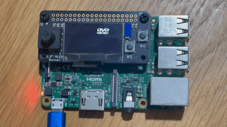

# 📀 Pi DVD Screensaver 📀



This project showcases a DVD screensaver animation on the Adafruit 128x64 OLED Bonnet for Raspberry Pi. The DVD logo bounces around the screen, changing direction upon pressing the corresponding buttons. The project was developed using ChatGPT, an AI language model.

---

## 📌 Table of Contents
- [🎥 Introduction](#introduction)
- [✨ Features](#features)
- [🛠 Requirements](#requirements)
- [🚀 Installation](#installation)
- [🎮 Usage](#usage)
- [🤝 Contributing](#contributing)
- [📝 License](#license)
- [🙏 Acknowledgements](#acknowledgements)

---

## 🎥 Introduction

This project provides a simple and fun DVD screensaver animation that can be displayed on the Adafruit 128x64 OLED Bonnet for Raspberry Pi.

---

## ✨ Features

- 🎵 Bouncing DVD logo animation on the OLED display
- 🕹 Button controls for changing the logo's direction
- 🔄 Screen inversion toggle functionality

---

## 🛠 Requirements

- Raspberry Pi
- Adafruit 128x64 OLED Bonnet
- Python 3.x

---

## 🚀 Installation

1. Clone the repository:
```shell
git clone https://github.com/2wenty2wo/pi-dvd-screensaver.git
```

2. Install the required dependencies:
```shell
pip install adafruit-circuitpython-ssd1306
pip install RPi.GPIO
```

3. Connect the Adafruit 128x64 OLED Bonnet to your Raspberry Pi.
4. Enable I2C using `raspi-config`. Run `sudo raspi-config`, navigate to Interface Options > I2C, and enable it, then reboot.

5. Run the script:
```shell
cd pi-dvd-screensaver
python pi-dvd-screensaver.py
```

---

## 🎮 Usage

- The DVD logo will start bouncing around the screen automatically.
- Use the D-pad to change the DVD logo's direction.

---

## 🤝 Contributing

Contributions are welcome! If you have any suggestions, improvements, or new features, feel free to open an issue or submit a pull request.

---

## 📝 License

This project is licensed under the [MIT License](https://github.com/2wenty2wo/pi-dvd-screensaver/blob/main/LICENSE).

---

## 🙏 Acknowledgements

This project was developed using ChatGPT, an AI language model. ChatGPT is an advanced language model developed by OpenAI.
